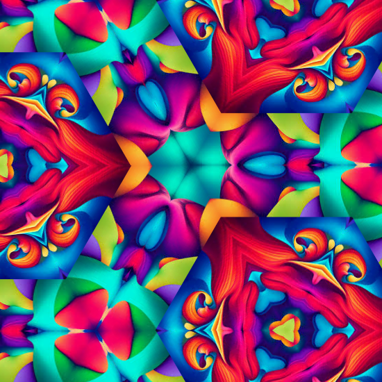

# Colliding Scopes

An open source project to turn photos into kaleidoscope animations.

## Live Demo
**Live demo: https://collidingscopes.github.io/**

## Overview
Built using javascript, HTML-5 canvas, and CSS.

Enormous thanks and credits to Luke Hannam, whose <a href="https://www.pepperoni.blog/canvas-kaleidoscope/" target="_blank" rel="noopener">blog post</a> explained the code and mechanics for creating kaleidoscope animations in javascript.

## Contributing

Contributions are welcome! Please feel free to submit a Pull Request.

## License

This project is licensed under the MIT License - see the [LICENSE](LICENSE.txt) file for details.

## Other Projects

Check out my other free/open source projects:
- [Particular Drift](https://collidingScopes.github.io/particular-drift): Turn images into flowing particle animations
- [Video-to-ASCII](https://collidingScopes.github.io/ascii): Turn videos into ASCII pixel art
- [Shape Shimmer](https://collidingScopes.github.io/shimmer): Turn photos into funky wave animations
- [Force-Field Animation](https://collidingScopes.github.io/forcefield): Turn photos into particle animations
- [Manual Brick Breaker](https://manual-brick-breaker.netlify.app): Play brick breaker by waving around your hands

## Donations
If you found this tool useful, feel free to buy me a coffee. This would be much appreciated during late-night coding sessions!

